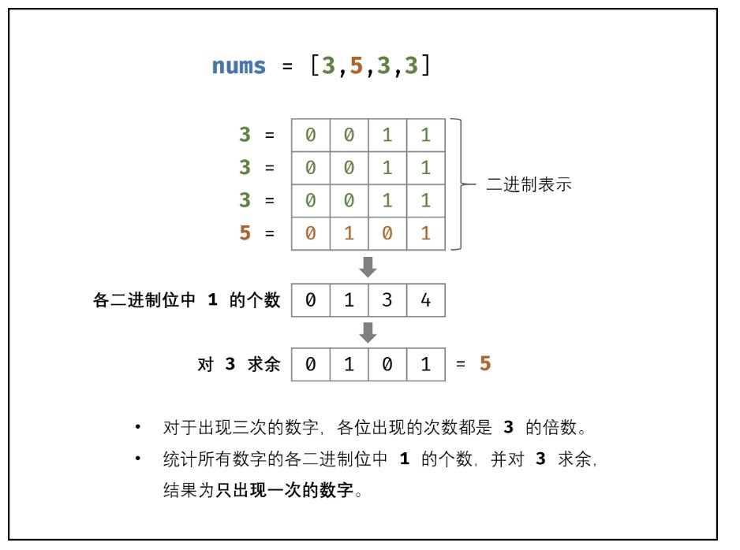

## 137. Single Number II

- [Link to LeetCode](https://leetcode.com/problems/single-number-ii/)

**Description:**


Given an integer array `nums` where every element appears **three times** except for one, which appears **exactly once**. *Find the single element and return it*.


<!-- tabs:start -->

### **Example 1:**

```
Input: nums = [2,2,3,2]
Output: 3
```

### **Example 2:**

```
Input: nums = [0,1,0,1,0,1,99]
Output: 99
```

<!-- tabs:end -->


**Constraints:**

- `1 <= nums.length <= 3 * 104`
- `-231 <= nums[i] <= 231 - 1`
- Each element in `nums` appears exactly **three times** except for one element which appears **once**.


**Follow up:** Your algorithm should have a linear runtime complexity. Could you implement it without using extra memory?


<!-- tabs:start -->

#### **Solution 1**



```java
// Bit Manipulation
// Time Complexity: O(n);
// Space Complexity: O(1)
class Solution {
   public int singleNumber(int[] nums) {
       int seenonce = 0;
       int seentwice = 0;
       for (int num : nums) {
           seenonce = ~seentwice & (seenonce ^ num);
           seentwice = ~seenonce & (seentwice ^ num);
       }
       return seenonce;
   }
}
```

<!-- tabs:end -->


