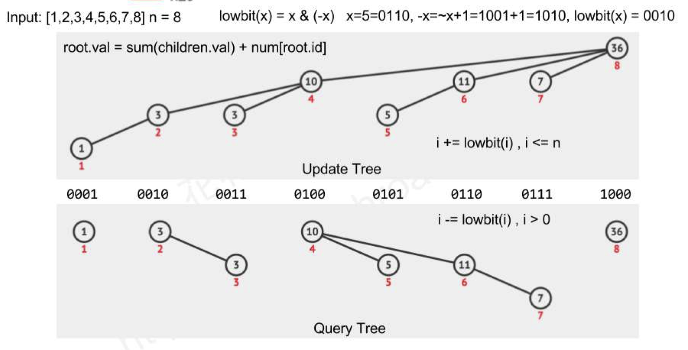

## 307. Range Sum Query - Mutable

- [Link to LeetCode](https://leetcode.com/problems/range-sum-query-mutable/)

**Description:**


Given an integer array *nums*, find the sum of the elements between indices *i* and *j* (*i* ≤ *j*), inclusive.

The *update(i, val)* function modifies *nums* by updating the element at index *i* to *val*.


<!-- tabs:start -->

### **Example 1:**


```
Given nums = [1, 3, 5]

sumRange(0, 2) -> 9
update(1, 2)
sumRange(0, 2) -> 8
```


<!-- tabs:end -->


**Constraints:**

- The array is only modifiable by the *update* function.
- You may assume the number of calls to *update* and *sumRange* function is distributed evenly.
- `0 <= i <= j <= nums.length - 1`


<!-- tabs:start -->

#### **Solution 1**



```java
class NumArray {
   int[] _nums;
   Fenwick _tree;
 
   public NumArray(int[] nums) {
       this._nums = nums;
       this._tree = new Fenwick(nums.length);
       for (int i = 0; i < nums.length; ++i)
           _tree.update(i + 1, nums[i]);
   }
  
   public void update(int i, int val) {
       int delta = val - _nums[i];
       _tree.update(i + 1, delta);
       _nums[i] = val;
   }
  
   public int sumRange(int i, int j) {
       return _tree.query(j + 1) - _tree.query(i);
   }
}
 
class Fenwick {
   public int[] _sum;
 
   public Fenwick(int n) {
       _sum = new int[n + 1];
   }
 
   public void update(int i, int delta) {
       while (i < _sum.length) {
           _sum[i] += delta;
           i += i & -i;
       }
   }
 
   public int query(int i) {
       int sum = 0;
       while (i > 0) {
           sum += _sum[i];
           i -= i & -i;
       }
       return sum;
   }
}
```


> Time Complexity: Init: O(n); Update: O(lgn); Query: O(lgn)
>
> Space Complexity: O(n)


#### **Solution 2**


```java
class NumArray {
   SegmentTree _tree;
 
   public NumArray(int[] nums) {
       this._tree = new SegmentTree(nums);
   }
  
   public void update(int i, int val) {
       _tree.updateTree(_tree._root, i, val);
   }
  
   public int sumRange(int i, int j) {
       return _tree.sumRange(_tree._root, i, j);
   }
}
 
class SegmentTree {
   public SegmentTreeNode _root;
 
   public SegmentTree() {}
  
   public SegmentTree(int[] nums) {
       _root = new SegmentTreeNode();
       if (nums.length != 0)
           _root = buildTree(0, nums.length - 1, nums);
   }
 
   public SegmentTreeNode buildTree(int s, int e, int[] nums) {
       if (s == e) return new SegmentTreeNode(s, e, nums[s], null, null);
       int m = s + (e - s) / 2;
       SegmentTreeNode left = buildTree(s, m, nums);
       SegmentTreeNode right = buildTree(m + 1, e, nums);
       return new SegmentTreeNode(s, e, left.sum + right.sum, left, right);
   }
  
   public void updateTree(SegmentTreeNode root, int i, int val) {
       if (root.s == i && root.e == i) {
           root.sum = val;
           return;
       }
       int m = root.s + (root.e - root.s) / 2;
       if (i <= m) updateTree(root.left, i, val);
       else updateTree(root.right, i, val);
       root.sum = root.left.sum + root.right.sum;
   }
  
   public int sumRange(SegmentTreeNode root, int i, int j) {
       if (root.s == i && root.e == j) return root.sum;
       int m = root.s + (root.e - root.s) / 2;
       if (j <= m) return sumRange(root.left, i, j);
       else if (i > m) return sumRange(root.right, i, j);
       else return sumRange(root.left, i, m) + sumRange(root.right, m + 1, j);
   }
  
   class SegmentTreeNode {
       public int s;
       public int e;
       public int sum; // Can be max/min.
       SegmentTreeNode left;
       SegmentTreeNode right;
      
       public SegmentTreeNode() {}
      
       public SegmentTreeNode(int s, int e, int sum,
                              SegmentTreeNode left,
                              SegmentTreeNode right) {
           this.s = s;
           this.e = e;
           this.sum = sum;
           this.left = left;
           this.right = right;
       }
   }
}
```


> Time Complexity: Init: O(n); Update: O(lgn); Query: O(lgn + k)
>
> Space Complexity: O(n)


<!-- tabs:end -->


