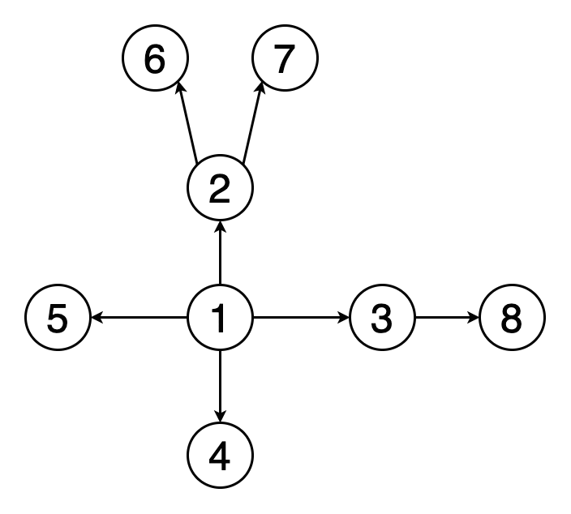
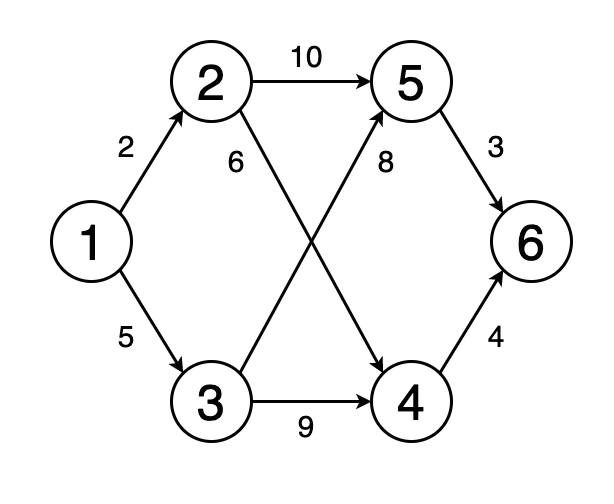
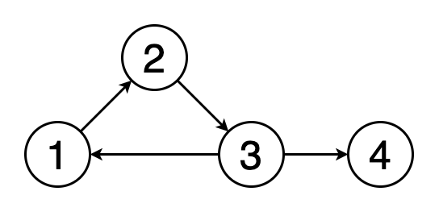
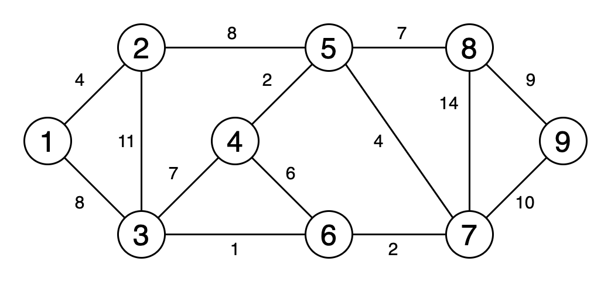
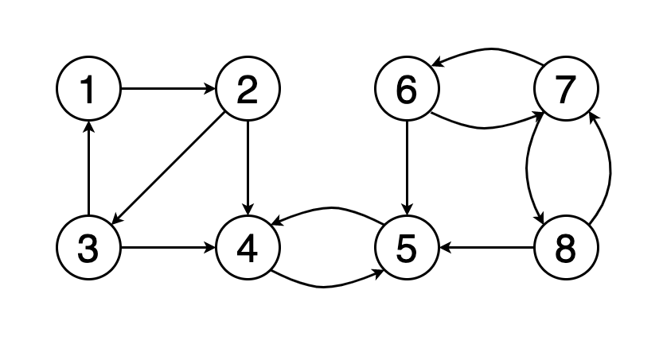
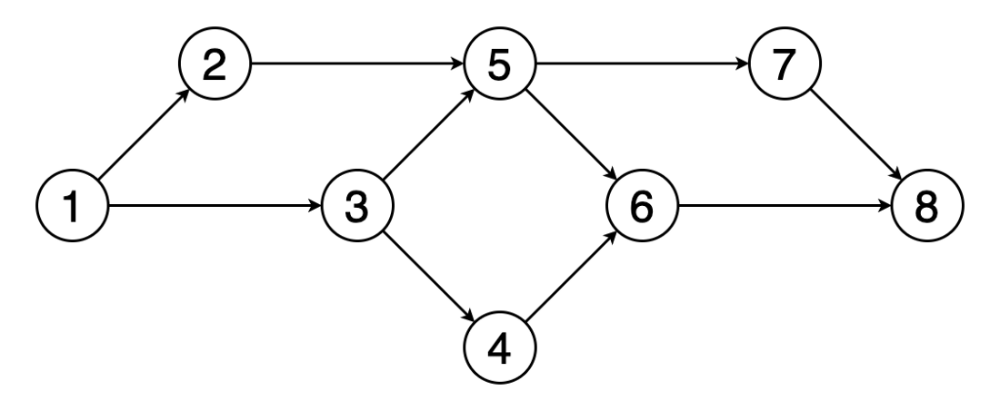
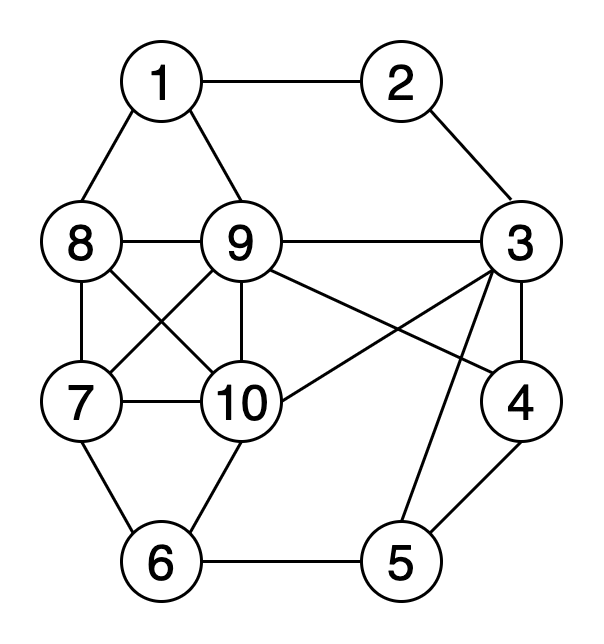
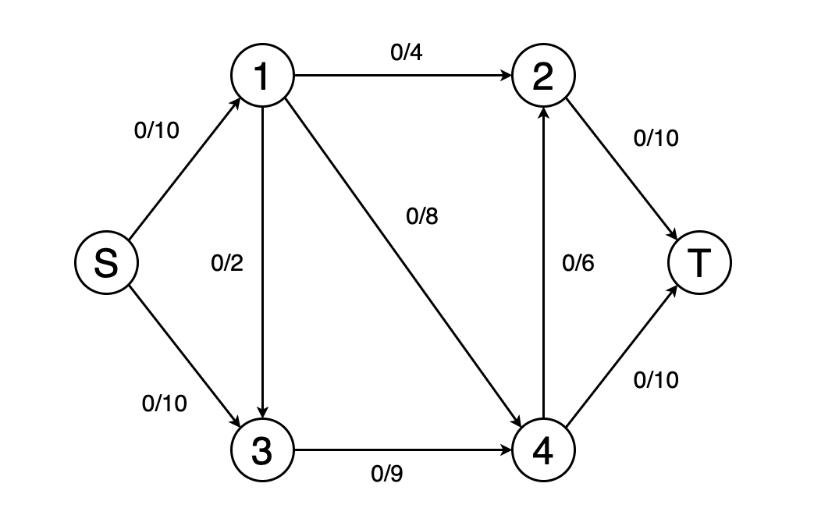
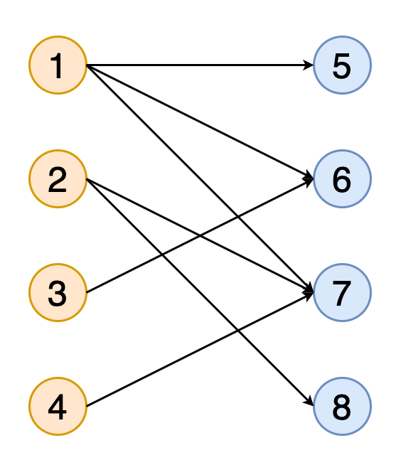

# Graph ALgorithms

> This part is about **LeetCode** **Graph** problems.

## What is Graph?

A **graph** consists of a finite set of **vertices** or nodes and a set of **edges** connecting these vertices. Two vertices are said to be **adjacent** if they are connected to each other by the same edge.

- **Order:** The number of vertices in the graph
- **Size:** The number of edges in the graph
- **Vertex degree:** The number of edges that are incident to a vertex
- **Isolated vertex:** A vertex that is not connected to any other vertices in the graph
- **Self-loop**: An edge from a vertex to itself
- **Directed graph:** A graph where all the edges have a direction indicating what is the start vertex and what is the end vertex
- **Undirected graph:** A graph with edges that have no direction
- **Weighted graph:** Edges of the graph has weights
- **Unweighted graph:** Edges of the graph has no weights

## 1. Breadth-first search

Start at a particular vertex and explore all of its neighbours at the present depth before moving on to the vertices in the next level. Usually a queue data structure is used in implementing BFS.

## 2. Depth-first search

Start from a particular vertex and explore as far as possible along each branch before retracing back (backtracking). A stack data structure is useddfs to support backtracking.

## 3. Shortest path

The ***shortest path\*** from one vertex to another vertex is a path in the graph such that the sum of the weights of the edges that should be travelled is minimum.

### Algorithms

1. Dijkstra’s shortest path algorithm
2. Bellman–Ford algorithmsho

## 4. Cycle detection

A *cycle* is a path in a graph where the first and last vertices are the same.

### Algorithms

1. Floyd cycle detection algorithm
2. Brent’s algorithm

## 5. Minimum spanning tree

A ***minimum spanning tree\*** is a subset of the edges of a graph that connects all the vertices with the minimum sum of edge weights and consists of no cycles.

### Algorithms

1. Prim’s algorithm
2. Kruskal’s algorithm

# 6. Strongly connected components

A graph is said to be ***strongly connected\*** if every vertex in the graph is reachable from every other vertex.

## Algorithms

1. Kosaraju’s algorithm
2. Tarjan’s strongly connected components algorithm

# 7. Topological sorting

***Topological sorting\*** of a graph is a linear ordering of its vertices so that for each directed edge (u, v) in the ordering, vertex u comes before v.

## Algorithms

1. Kahn’s algorithm
2. The algorithm based on depth-first search

# 8. Graph colouring

***Graph colouring\*** assigns colours to elements of a graph while ensuring certain conditions.

## Algorithms

1. Algorithms using breadth-first search or depth-first search
2. Greedy colouring

# 9. Maximum flow

e can model a graph as a flow network with edge weights as flow capacities. In the ***maximum flow\*** problem, we have to find a flow path that can obtain the maximum possible flow rate.

## Algorithms

1. Ford-Fulkerson algorithm
2. Edmonds–Karp algorithm
3. Dinic’s algorithm

# 10. Matching

A ***matching\*** in a graph is a set of edges that does not have common vertices (i.e., no two edges share a common vertex).

## Algorithms

1. Hopcroft-Karp algorithm
2. Hungarian algorithm
3. Blossom algorithm

## Problem List

* Queue + HashMap
  * [133. Clone Graph](leetcode/graph/133.CloneGraph.md) (DFS/BFS)
* grid + connected components
  * [200. Number of Islands](leetcode/graph/200.number-of-islands.md)
  * [547. Friend Circles](leetcode/graph/547.friend-circles.md) (DFS/DSU w/ path compression/ DSU w/o path compression)
  * [695. Max Area of Island](leetcode/graph/695.max-area-of-island.md)

* DFS + connected components
  * [841. Keys and Rooms](leetcode/graph/841.keys-and-rooms.md)

* Topological sorting
  * [207. Course Schedule](leetcode/graph/207.Course-chedule.md)
  * [210. Course Schedule II](leetcode/graph/210.Course-chedule-II.md)

* Union Find
  * [399. Evaluate Division](leetcode/graph/399.Evaluate-Division.md) (DFS/DSU w/o path compression/ DSU w/ path compression)
  * [721. Accounts Merge](leetcode/graph/721.Accounts-Merge.md)

* cycle, union find
  * []

* bipartition, graph coloring
  * [785. Is Graph Bipartite?](leetcode/graph/785.Is-Graph-Bipartite.md)

* in/out degrees
  * [997. Find the Town Judge](leetcode/graph/997.Find-the-Town-Judge.md)

* unweighted shortest path / BFS
  * []

* weighted shortest path
  * [743. Network Delay Time](leetcode/graph/743.Network-Delay-Time.md) (BFS/DFS/Dijkstra/Bellman Ford SSSP/Floyd-Warshall all shortest paths)
  * [787. Cheapest Flights Within K Stops](leetcode/graph/787.Cheapest-Flights-Within-K-Stops.md) (DFS/BFS/Bellman Ford)
  * [1334. Find the City With the Smallest Number of Neighbors at a Threshold Distance](leetcode/graph/1334.Find-the-City-With-the-Smallest-Number-of-Neighbors-at-a-Threshold-Distance.md) (Floyd-Warshall/Dijkstra)

* Eulerian path
  * [332. Reconstruct Itinerary](leetcode/graph/332.Reconstruct-Itinerary.md) (DFS)

* Tarjan
  * [1192. Critical Connections in a Network](leetcode/graph/1192.Critical-Connections-in-a-Network.md)

* Hamiltonian path (DFS / DP)
  * []

* union find / grid + CCs
  * []

* Minimum Spanning Tree
  * [1489. Find Critical and Pseudo-Critical Edges in Minimum Spanning Tree](leetcode/graph/1489.Find-Critical-and-Pseudo-Critical-Edges-in-Minimum-Spanning-Tree.md) (Prim/Kruskal)

