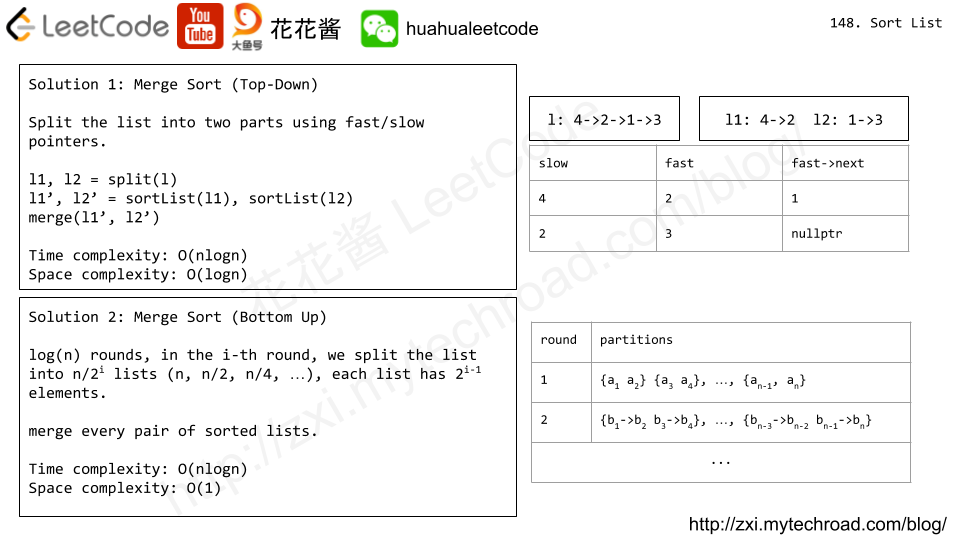

## 148. Sort List

- [Link to LeetCode](https://leetcode.com/problems/sort-list/)

**Description:**


Given the `head` of a linked list, return *the list after sorting it in **ascending order***.

**Follow up:** Can you sort the linked list in `O(n logn)` time and `O(1)` memory (i.e. constant space)?


<!-- tabs:start -->

### **Example 1:**


```
Input: head = [4,2,1,3]
Output: [1,2,3,4]
```

### **Example 2:**


```
Input: head = [-1,5,3,4,0]
Output: [-1,0,3,4,5]
```

### **Example 3:**

```
Input: head = []
Output: []
```

<!-- tabs:end -->


**Constraints:**

- The number of nodes in the list is in the range `[0, 5 * 10^4]`.
- `-10^5 <= Node.val <= 10^5`


<!-- tabs:start -->





#### **Solution 1**


```java
// Merge Sort (Top Down)
// Time Complexity: O(nlgn)
// Space Complexity: O(lgn)
class Solution {
   public ListNode sortList(ListNode head) {
       if (head == null || head.next == null) return head;
       ListNode slow = head;
       ListNode fast = head.next;
       while (fast != null && fast.next != null) {
           fast = fast.next.next;
           slow = slow.next;
       }
       ListNode right = slow.next;
       slow.next = null;
       return merge(sortList(head), sortList(right));
   }
  
   public ListNode merge(ListNode l1, ListNode l2) {
       ListNode dummy = new ListNode();
       ListNode tail = dummy;
       while (l1 != null && l2 != null) {
           if (l1.val > l2.val) {
               ListNode tmp = l1;
               l1 = l2;
               l2 = tmp;
           }
           tail.next = l1;
           l1 = l1.next;
           tail = tail.next;
       }
       tail.next = (l1 == null) ? l2 : l1;
       return dummy.next;
   }
}
```


#### **Solution 2**


```java
// Merge Sort(Bottom Up)
// Time Complexity: O(nlgn)
// Space Complexity: O(1)
class Solution {
   public ListNode sortList(ListNode head) {
       if (head == null || head.next == null) return head;
       int len = 1;
       ListNode curr = head;
       while (curr.next != null) {
           ++len;
           curr = curr.next;
       }
      
       ListNode dummy = new ListNode();
       dummy.next = head;
       ListNode l, r, tail;
       for (int n = 1; n < len; n <<= 1) {
           curr = dummy.next; // partial sorted list head
           tail = dummy;
           while (curr != null) {
               l = curr;
               r = split(l, n);
               curr = split(r, n);
               ListNode[] merged = merge(l, r);
               tail.next = merged[0];
               tail = merged[1];
           }
       }
      
       return dummy.next;
   }
   // Split the list into two parts, first n elements and the rest.
   // Return the head of the rest.
   public ListNode split(ListNode head, int n) {
       while ((--n > 0) && head != null) {
           head = head.next;
       }
       ListNode rest = (head == null) ? null : head.next;
       if (head != null) head.next = null;
       return rest;
   }
   // Merge two lists, return the head and tail of the merged list.
   public ListNode[] merge(ListNode l1, ListNode l2) {
       ListNode dummy = new ListNode();
       ListNode tail = dummy;
       while (l1 != null && l2 != null) {
           if (l1.val > l2.val) {
               ListNode tmp = l1;
               l1 = l2;
               l2 = tmp;
           }
           tail.next = l1;
           l1 = l1.next;
           tail = tail.next;
       }
       tail.next = (l1 == null) ? l2 : l1;
       while (tail.next != null) tail = tail.next;
       return new ListNode[]{dummy.next, tail};
   }
}

```


<!-- tabs:end -->


