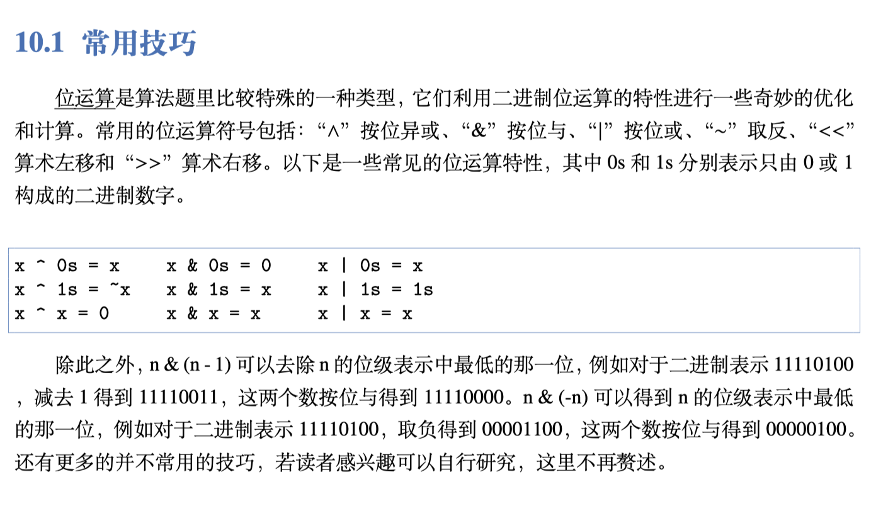

# Math

> This part is about **LeetCode** **Math** problems.


```
private int lcm (int a, int b) {
	int gcd = 1;
	for (int i = 1; i <= a && i <= b; ++i) {
		if (a % i == 0 && b % i == 0)
		gcd = i;
		}
	return a * b / gcd;
}

private int lcm (int a, int b) {
	int lcm = a > b ? a : b;
	while (true) {
		if (lcm % a == 0 && lcm % b == 0) {
			break;
		}
		++lcm;
	}
	return lcm;
}

private int lcm (int a, int b) {
	int max = Math.max(a, b);
	int min = Math.min(a, b);
	int lcm = max;
	while (lcm % min != 0) {
		lcm += max;
	}
	return lcm;
}

private int lcm(int a, int b) {
	return a * (b / gcd(a, b));
}
private int gcd(int a, int b) {
	if (b == 0) return a;
	else return gcd(b, a % b);
}

private long lcm(long a, long b) {
	return a * (b / gcd(a, b));
}

private long gcd(long a, long b) {
	return (b == 0) ? a : gcd(b, a % b);
}

private long gcd(long a, long b) {
	while (b > 0) {
		long temp = b;
		b = a % b;
		a = temp;
	};
	return a;
}
```


[Proof:](https://blog.csdn.net/afei__/article/details/80216247)




[Ref](https://stackoverflow.com/questions/47779830/what-does-bitwise-operation-nn-1-do)


```
n & -n
n & ~(n - 1)
n & ~n+1
three equation get the same result
```


[Proof:](https://dslztx.github.io/blog/2016/06/26/%E2%80%9C%E5%8F%96%E5%8F%8D%E5%8A%A0%E4%B8%80%E2%80%9D%E7%AD%89%E4%BB%B7%E4%BA%8E%E2%80%9C%E5%87%8F%E4%B8%80%E5%8F%96%E5%8F%8D%E2%80%9D%E7%9A%84%E8%AF%81%E6%98%8E/)


## Problem List

* Prime numbers
  * [204. Count Primes](leetcode/math/204.Count-Primes.md)

* Number processing
  * [415. Add Strings](leetcode/math/415.Add-Strings.md)
  * [67. Add Binary](leetcode/math/67.Add-Binary.md)
  * [238. Product of Array Except Self](leetcode/math/238.Product-of-Array-Except-Self.md)
  * [169. Majority Element](leetcode/math/169.Majority-Element.md)
  * [202. Happy Number](leetcode/math/202.Happy-Number.md)

* Random & sample
  * [384. Shuffle an Array](leetcode/math/384.Shuffle-an-Array.md)
  * [528. Random Pick with Weight](leetcode/math/528.Random-Pick-with-Weight.md)

* Bit operation
  * [136. Single Number](leetcode/math/136.Single-Number.md)
  * [137. Single Number II](leetcode/math/137.Single-Number-II.md)
  * [260. Single Number III](leetcode/math/260.Single-Number-III.md)


  


  


