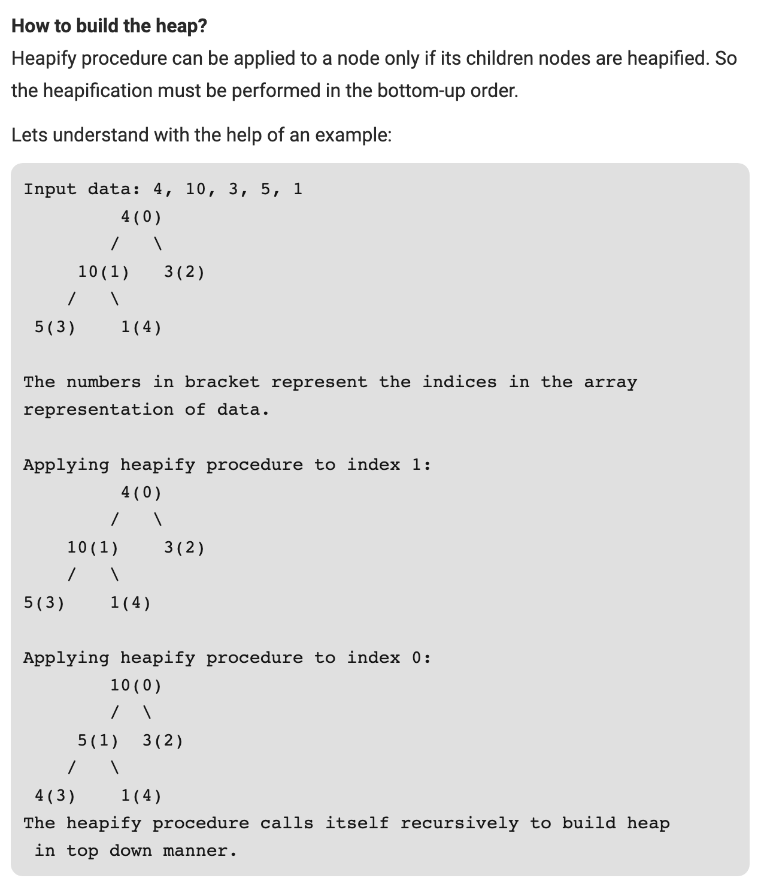

## 912. Sort an Array

- [Link to LeetCode](https://leetcode.com/problems/sort-an-array/)

**Description:**


Given an array of integers `nums`, sort the array in ascending order.


<!-- tabs:start -->

### **Example 1:**

```
Input: nums = [5,2,3,1]
Output: [1,2,3,5]
```

### **Example 2:**

```
Input: nums = [5,1,1,2,0,0]
Output: [0,0,1,1,2,5]
```

<!-- tabs:end -->


**Constraints:**

- `1 <= nums.length <= 50000`
- `-50000 <= nums[i] <= 50000`


**Order:** (Counging Sort/Quick Sort/Heap Sort(Max-Min Heap)/Merge Sort/Bubble Sort/Selection Sort/Inserton Sort)


<!-- tabs:start -->

#### **Solution 1**


```java
class Solution {
    public int[] sortArray(int[] nums) {
        int[] count = new int[50000 * 2 + 1];
        for (int num : nums) {
            ++count[num + 50000];
        }
        int idx = 0;
        for (int i = 0; i < count.length; ++i) {
            while (count[i]-- > 0) {
                nums[idx++] = i - 50000;
            }
        }
        return nums;
    }
}
```


> // Counting Sort
>
> // Time Complexity: O(n)
>
> // Space Complexity: O(max(nums) - min(nums))


#### **Solution 2**


```java
class Solution {
    public int[] sortArray(int[] nums) {
        quickSort(nums, 0, nums.length - 1);
        return nums;
    }
    
    public void quickSort(int[] nums, int l, int r) {
        if (l >= r) return;
        // 下面两行是随机快排，隐去的话，就是每次选取最左边的作为pivot
        int p = l + (int) ((Math.random() * Integer.MAX_VALUE) % (r - l + 1));
        swap(nums, l, p);
        int mid = partition(nums, l, r);
        quickSort(nums, l, mid - 1);
        quickSort(nums, mid + 1, r);
    }
    
    public int partition(int[] nums, int l, int r) {
        int ol = l;
        int pivot = nums[l++];
        while (true) {
          // if (l == r) {
          //   if (nums[l] <= pivot) {
          //       already done, no need to compare;
          //   }
          //   else {
          //       no change for l; no need to compare;
          //   }
          // }
            while (l < r && nums[l] <= pivot) ++l; // Either keep number equals pivot left or right, here we choose left;
            while (l <= r && nums[r] > pivot) --r; // keep nums[r] <= pivot
            if (l >= r) break;
            swap(nums, l, r);
        }
        swap(nums, ol, r);
        return r;
    }
    
    public void swap(int[] nums, int i, int j) {
        int temp = nums[i];
        nums[i] = nums[j];
        nums[j] = temp;
    }
}
```


> // Quick Sort
>
> // Time Complexity: O(nlgn)
>
> // Space Complexity: O(lgn)


#### **Solution 3**




> **-> (n/2^1 \* 0) + (n/2^2 \* 1)+ (n/2^3 \* 2) + (n/2^4 \* 3) +...+ (n/2^(h+1) \* h)** **-> n \* ( 0 + 1/4 + 2/8 + 3/16 +...+ h/2^(h+1) )**


```java
class Solution {
    public int[] sortArray(int[] nums) {
        int n = nums.length;
        // Init a max heap 
        for (int i = n / 2 - 1; i >= 0; --i)
            heapify(nums, i, n - 1);
        // Get max
        for (int i = n - 1; i >= 1; --i) {
            swap(nums, 0, i);
            heapify(nums, 0, i - 1);
        }
        return nums;
    }
    
    public void heapify(int[] nums, int i, int len) {
        while (i <= len) {
            int l = 2 * i + 1;
            int r = 2 * i + 2;
            int large = i;
            while (l <= len && nums[l] > nums[large]) large = l;
            while (r <= len && nums[r] > nums[large]) large = r;
            if (i == large) break;
            swap(nums, i, large);
            i = large;
        }
    }
    
    public void swap(int[] nums, int i, int j) {
        int tmp = nums[i];
        nums[i] = nums[j];
        nums[j] = tmp;
    }
}
```


> // Heap Sort (Max Heap)
>
> // Time Complexity: O(nlgn)
>
> // Space Complexity: O(n)


#### **Solution 4**


```java
class Solution {
    public int[] sortArray(int[] nums) {
        int n = nums.length;
        // Init a max heap 
        for (int i = n / 2 - 1; i >= 0; --i)
            heapify(nums, i, n - 1);
        // Get min
        for (int i = n - 1; i >= 1; --i) {
            swap(nums, 0, i);
            heapify(nums, 0, i - 1);
        }
        // Reverse the array, because min heap is used above
        for (int i = 0; i < nums.length / 2; ++i)
            swap(nums, i, nums.length - 1 - i);
        return nums;
    }
    
    public void heapify(int[] nums, int i, int len) {
        while (i <= len) {
            int l = 2 * i + 1;
            int r = 2 * i + 2;
            int large = i;
            while (l <= len && nums[l] < nums[large]) large = l;
            while (r <= len && nums[r] < nums[large]) large = r;
            if (i == large) break;
            swap(nums, i, large);
            i = large;
        }
    }
    
    public void swap(int[] nums, int i, int j) {
        int tmp = nums[i];
        nums[i] = nums[j];
        nums[j] = tmp;
    }
}
```


> // Heap Sort (min Heap)
>
> // Time Complexity: O(nlgn)
>
> // Space Complexity: O(n)


#### **Solution 5**


```java
class Solution {
    public int[] sortArray(int[] nums) {
        mergeSort(nums, 0, nums.length - 1);
        return nums;
    }
    // left close, right close
    public void mergeSort(int[] nums, int l, int r) {
        if (l >= r) return;
        int mid = l + (r - l) / 2;
        mergeSort(nums, l, mid);
        mergeSort(nums, mid + 1, r);
        merge(nums, l, mid, r);
    }
    
    public void merge(int[] nums, int l, int mid, int r) {
        int[] cache = new int[r - l + 1];
        int i = l, j = mid + 1, k = 0;
        while (i <= mid && j <= r) {
            if (nums[i] < nums[j]) cache[k++] = nums[i++];
            else cache[k++] = nums[j++];
        }
        while (i <= mid) cache[k++] = nums[i++];
        while (j <= r) cache[k++] = nums[j++];
        for (int idx = 0; idx < cache.length; ++idx) {
            nums[idx + l] = cache[idx]; 
        }
    }
}
```


> // Merge Sort
>
> // Time Complexity: O(nlgn)
>
> // Space Complexity: O(n+lgn)


#### **Solution 6**


```java
class Solution {
    public int[] sortArray(int[] nums) {
        for (int i = 0; i < nums.length; ++i) {
            for (int j = 1; j < nums.length - i; ++j) {
                if (nums[j - 1] > nums[j]) {
                    int tmp = nums[j];
                    nums[j] = nums[j - 1];
                    nums[j - 1] = tmp;
                }
            }
        }
        return nums;
    }
}
```


> //  TLE ms
>
> // Bubble Sort
>
> // Time Complexity: O(n^2)
>
> // Space Complexity: O(1)


#### **Solution 7**


```java
class Solution {
    public int[] sortArray(int[] nums) {
        for (int i = 0; i < nums.length; ++i) {
            int minIndex = i;
            for (int j = i + 1; j < nums.length; ++j) {
                if (nums[j] < nums[minIndex]) {
                    minIndex = j;
                }
            }
            int tmp = nums[i];
            nums[i] = nums[minIndex];
            nums[minIndex] = tmp;
        }
        return nums;
    }
}
```


> // Selection Sort
>
> // Time Complexity: O(n^2)
>
> // Space Complexity: O(1)


#### **Solution 8**


```java
class Solution {
    public int[] sortArray(int[] nums) {
        for (int i = 1; i < nums.length; ++i) {
            int key = nums[i];
            int j = i - 1;
            while (j >= 0 && nums[j] > key) {
                nums[j + 1]  = nums[j];
                --j;
            }
            nums[j + 1] = key;
        }
        return nums;
    }
}
```


> // Insertion Sort
>
> // Time Complexity: O(n^2)
>
> // Space Complexity: O(1)


<!-- tabs:end -->


